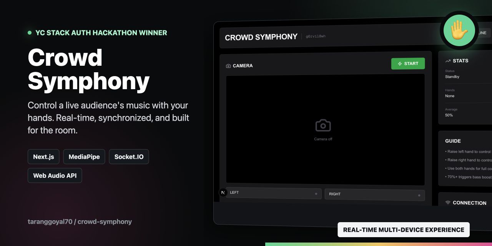

# 🎵 Crowd Symphony



Control music with hand gestures! Be the conductor and control the volume for your entire audience in real-time.

## ✨ Features

- **Conductor Mode**: Use your laptop camera to detect hand gestures
- **Audience Mode**: Join via QR code and let the conductor control your volume
- **Real-time Sync**: WebSocket-powered instant volume changes
- **Left/Right Sections**: Divide your audience into sections
- **Beautiful UI**: Gradient animations and smooth transitions

## 🚀 How It Works

### For Conductors:
1. Open the app and click "Be the Conductor"
2. Allow camera access
3. Share the QR code with your audience
4. Move your hands up = volume increases
5. Move your hands down = volume decreases

### For Audience:
1. Scan the QR code from the conductor
2. Choose your section (left or right)
3. Press play

---

## ✨ **Features**

### **🎛️ Conductor Mode**
- **Hand Tracking** - MediaPipe-powered gesture detection
- **Dual Control** - Left and right hand control separate sections
- **Real-time Feedback** - See volume levels and connected users
- **Professional UI** - Clean, modern dashboard
- **QR Code Generation** - Easy audience joining

### **📱 Audience Mode**
- **4 Music Tracks** - Choose your favorite
- **Bass Boost** - Automatic at 70%+ volume
- **Special Effects:**
  - 💥 Screen flash
  - 🌊 Screen shake (85%+)
  - ⚡ Strobe mode (90%+)
  - 🎆 Particle explosions
  - 📳 Phone vibration
- **Section Selection** - Join left or right side

### **🔥 Real-time Features**
- **Realtime Control** - Low-latency conductor updates via Vercel Functions
- **Session Management** - Multiple concurrent sessions
- **User Tracking** - See how many people are connected
- **Auto-sync** - All phones respond together

---

## 🛠️ **Tech Stack**

- **Frontend:** Next.js 16, React 19, TypeScript
- **Styling:** Tailwind CSS, Framer Motion
- **Hand Tracking:** MediaPipe Hands
- **Audio:** Web Audio API
- **Real-time:** Vercel Functions + Runtime Cache
- **QR Codes:** qrcode.react
- **Icons:** Lucide React

---

## 🚀 **Quick Start**

### **Prerequisites**
- Node.js 18+
- npm or yarn
- Camera-enabled device (for conductor)
- A deployed Vercel URL, or Vercel CLI for local realtime testing

### **Installation**

```bash
# Clone the repository
git clone https://github.com/YOUR_USERNAME/crowd-symphony.git
cd crowd-symphony

# Install dependencies
npm install

# Start the Vercel development server
npm run dev
```

The app will be available at:
- **Conductor:** http://localhost:3000/conductor
- **Audience:** http://localhost:3000/audience

---

## 📖 **How to Use**

### **Step 1: Start Conductor**
1. Open `http://YOUR_IP:3000/conductor` on your computer
2. Click "START" to enable camera
3. Click "QR" to show the QR code

### **Step 2: Join Audience**
1. Scan QR code with phone camera
2. Select section (Left or Right)
3. Choose a music track
4. Press "Drop It" to start

### **Step 3: Conduct!**
- **Raise left hand** → Increase left section volume
- **Raise right hand** → Increase right section volume
- **70%+ volume** → Bass boost + effects activate
- **90%+ volume** → FULL CHAOS MODE! 🔥

---

## 🎵 **Adding Your Own Music**

### **Method 1: Local Files**
```bash
# Add MP3 files to public/music/
cp your-song.mp3 public/music/

# Update app/audience/page.tsx
{
  name: "Your Song",
  url: "/music/your-song.mp3"
}
```

### **Method 2: Online URLs**
```typescript
{
  name: "Your Song",
  url: "https://example.com/song.mp3"
}
```

See [HOW_TO_ADD_MUSIC.md](HOW_TO_ADD_MUSIC.md) for detailed instructions.

---

## 🌐 **Vercel Setup**

This app is Vercel-ready. Realtime uses the `/api/realtime` route with Vercel Runtime Cache, so there is no hardcoded local IP address or separate Socket.IO server to deploy.

```bash
npm install
npm run build
vercel deploy --prod
```

For local testing, use `npm run dev` so the app runs through Vercel CLI and matches production routing.

---

## 📁 **Project Structure**

```
crowd-symphony/
├── app/
│   ├── conductor/page.tsx    # Conductor interface
│   ├── audience/page.tsx     # Audience interface
│   ├── test/page.tsx         # Network test page
│   └── globals.css           # Global styles
├── public/
│   └── music/                # Music files
│       ├── dubstep.mp3
│       └── orchestra.mp3
├── app/api/realtime/route.ts # Vercel realtime route
├── package.json              # Dependencies
└── README.md                 # This file
```

---

## 🐛 **Troubleshooting**

### **QR Code Not Working?**
See [QR_CODE_TROUBLESHOOTING.md](QR_CODE_TROUBLESHOOTING.md)

### **Volume Not Changing?**
1. Check browser console for logs
2. Ensure camera is started on conductor
3. Verify same session ID on both devices
4. Check WiFi connection

### **Music Not Playing?**
1. Press "Drop It" button on phone
2. Check phone is not muted
3. Verify music file exists in `/public/music/`

---

## 🎯 **Performance Tips**

- Use MP3 files under 5MB for faster loading
- Keep music bitrate at 128-192 kbps
- Test on same WiFi network
- Close other apps on phones for better performance

---

## 🤝 **Contributing**

Contributions are welcome! Please feel free to submit a Pull Request.

---

## 📝 **License**

MIT License - feel free to use this project for any purpose!

---

## 🙏 **Credits**

- **MediaPipe** - Hand tracking technology
- **Vercel Functions** - Realtime conductor/audience communication
- **Next.js** - React framework
- **Tailwind CSS** - Styling
- **Framer Motion** - Animations

---

## 📧 **Contact**

Have questions or suggestions? Open an issue on GitHub!

---

**Made with ❤️ for interactive music experiences**

🎵 **Drop the beat, control the crowd!** 🎵

- Multiple music tracks
- Tempo control with gestures
- Sound effects
- Recording sessions
- Leaderboards
- Team mode

---

Built with ❤️ for interactive music experiences
